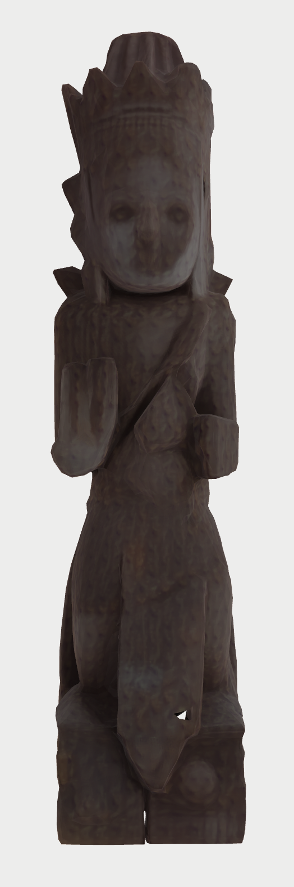

# AI4Culture

## Context

This project was done in the context of the AI4 Culture Hackaton 12-20 Feb 2025, Leuven, https://www.arts.kuleuven.be/digitglam/ai4culture-hackathon.

The project members were:
- Zita Baronnet
- Francesco Gavioli
- Lara Peeters

The project A.B.C. (Automating Blender Code) originated from an idea by Zita, which Lara and Francesco fully embraced. We all contributed to refining the concept, making it a truly collaborative effort. 
In short, A.B.C. focuses on automating the conversion of 2D images from the Europeana dataset into 3D models using open-source AI tools.

Yet, as we know, 3D digitisation is expensive and requires specialised equipment and expertise. At the same time, we know that Europeana already hosts extensive collections of digitised 2D objects, providing a valuable resource for 3D reconstruction.
Our research has shown that the open-source software Blender has been widely used for 3D modelling in cultural heritage. At the same time, we noticed that some studies have begun to explore 3D model generation from line drawings. Additionally, our literature review suggests that AI tools like Segment Anything could offer a promising solution for precise shape extraction from 2D images. To date, only one study has investigated the integration of image segmentation and 3D reconstruction in cultural heritage digitisation.

## Description

The demand for 3D models for cultural heritage is growing, as evidenced by recent Europeana initiatives like EUreka3D (a project funded by the Digital Europe Programme, supporting the 3D digital transformation in the cultural heritage sector). 
Yet, as we know, 3D digitisation is expensive and requires specialised equipment and expertise. At the same time, we know that Europeana already hosts extensive collections of digitised 2D objects, providing a valuable resource for 3D reconstruction.
Our research has shown that the open-source software Blender has been widely used for 3D modelling in cultural heritage. At the same time, we noticed that some studies have begun to explore 3D model generation from line drawings. Additionally, our literature review suggests that AI tools like Segment Anything could offer a promising solution for precise shape extraction from 2D images. To date, only one study has investigated the integration of image segmentation and 3D reconstruction in cultural heritage digitisation.

## Example




## Installing (MacOS)
### Installation script
```
# Set the write path for you system in the script
./install_MacOS.sh
```

### Installations steps
#### Set environment variables

```
export BLENDER_INSTALL_DIR=/Applications/Blender.app/Contents/Resources
export BLENDER_PYTHON=$BLENDER_INSTALL_DIR/4.3/python
# example full path to python shipped with Blender
# /Applications/Blender.app/Contents/Resources/4.3/python/bin/python3.11
export EXTRA_BLENDER_MODULES=PATH_EXTERNAL_BLENDER_DIR/Blender
# example /Users/$USER/Python/Blender
```

#### Install dependencies for segmentation step

Only need to install them once. If you want to install more packages on top of these you have to make sure that PYTHONPATH is set to all the subdirs.
```
# Set the environment so that the site-packages are found
export PYTHONPATH=$BLENDER_PYTHON/lib/python3.10/site-packages

$BLENDER_PYTHON/bin/python3.10 -m pip install --target $EXTRA_BLENDER_MODULES/Segment-Anything git+https://github.com/facebookresearch/segment-anything.git
export PYTHONPATH=$PYTHONPATH:$EXTRA_BLENDER_MODULES/Segment-Anything

$BLENDER_PYTHON/bin/python3.10 -m pip install --target $EXTRA_BLENDER_MODULES/PyTorch torch torchvision
export PYTHONPATH=$PYTHONPATH:$EXTRA_BLENDER_MODULES/PyTorch

$BLENDER_PYTHON/bin/python3.10 -m pip install --target $EXTRA_BLENDER_MODULES/OpenCV opencv-python pycocotools
export PYTHONPATH=$PYTHONPATH:$EXTRA_BLENDER_MODULES/OpenCV

$BLENDER_PYTHON/bin/python3.10 -m pip install --target $EXTRA_BLENDER_MODULES/Polygon shapely
export PYTHONPATH=$PYTHONPATH:$EXTRA_BLENDER_MODULES/Polygon
```

#### Install dependencies for 3d model step
##### With Selenium
```
# install Chromedriver with HomeBrew
# install Selenium with pip

# Installing selenium
$PATH_TO_BLENDER/Contents/Resources/4.3/python/bin/python3.11 -m pip install --target $PATH_TO_EXTRA_BLENDER_MODULES/selenium selenium
export PYTHONPATH=$PYTHONPATH:$PATH_TO_EXTRA_BLENDER_MODULES/selenium
```
